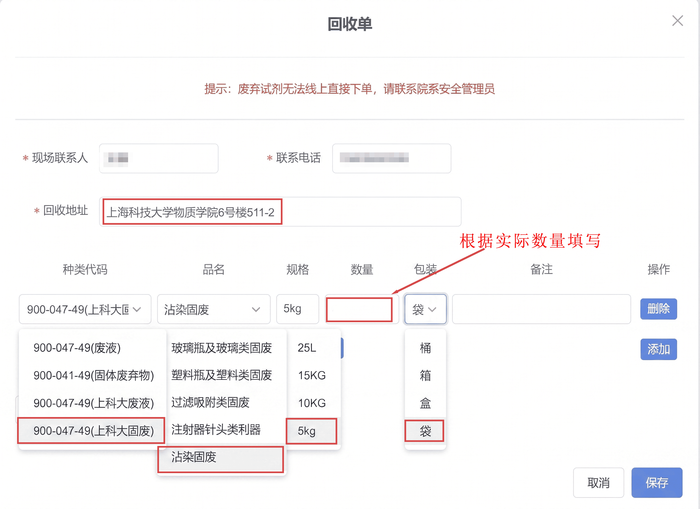
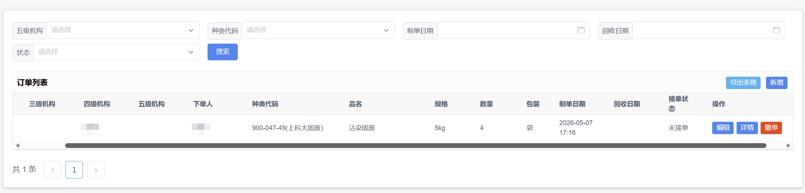
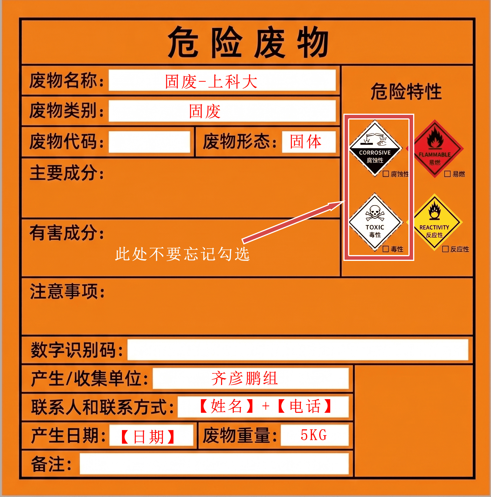
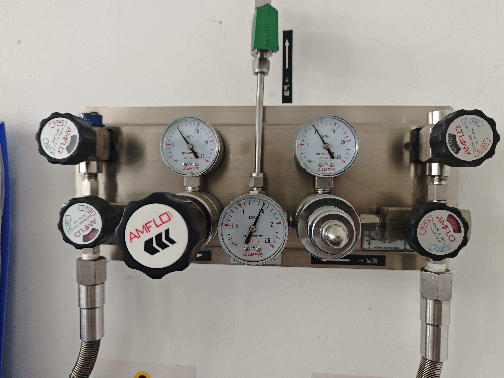
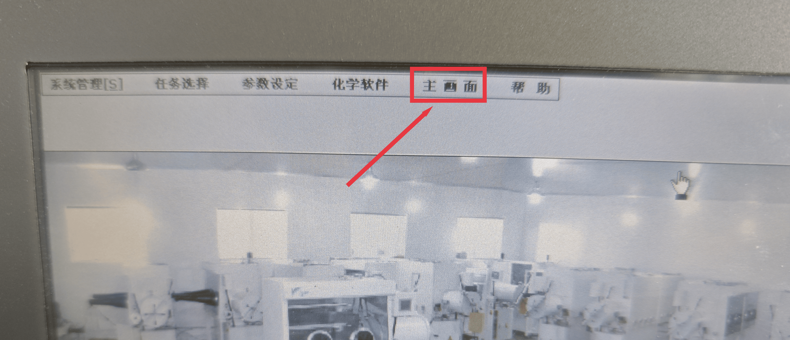

# 实验室日常清洁流程 

## 垃圾处理 
每周四需要记得在系统上下单，然后在次日（周五）中午11时左右将处理后的黄色垃圾袋放置于实验室门口。下单填写实例如下： 

 

 

黄色垃圾袋处理之后，需要使用轧带封口，并贴上危废品警告标签，按照以下要求填写标签。最后在垃圾袋上写上本组名字。 

 

---

## 气瓶检查 
需要检查气压表，如果气压过低，需要及时更换气瓶。

 

---

## 手套箱 
需要检查手套箱中水含量和氧含量是否正常。 

 

 